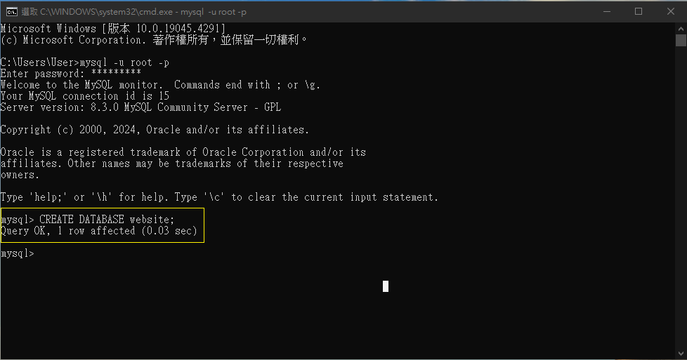
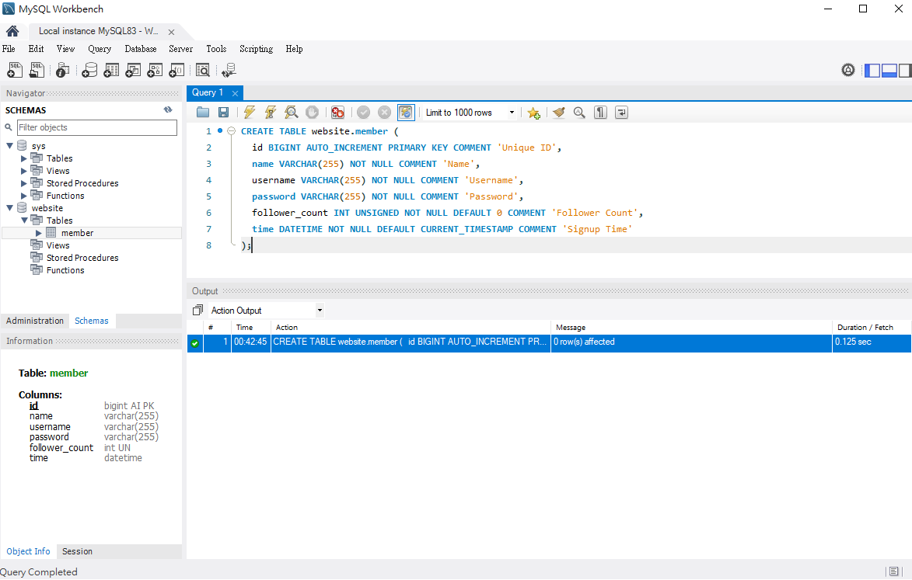
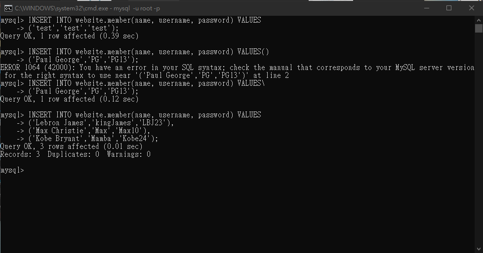

## Task 2 Create database and table in your MySQL server
- Create a new database named website.    
	```SQL
	CREATE DATABASE website
	```
	
- Create a new table named member, in the website database, designed as below:
	```SQL
	CREATE TABLE website.member (
	  id BIGINT AUTO_INCREMENT PRIMARY KEY COMMENT 'Unique ID',
	  name VARCHAR(255) NOT NULL COMMENT 'Name',
	  username VARCHAR(255) NOT NULL COMMENT 'Username',
	  password VARCHAR(255) NOT NULL COMMENT 'Password',
	  follower_count INT UNSIGNED NOT NULL DEFAULT 0 COMMENT 'Follower Count',
	  time DATETIME NOT NULL DEFAULT CURRENT_TIMESTAMP COMMENT 'Signup Time'
	);
	```
	
 ---
## Task 3: SQL CRUD
- INSERT a new row to the member table where name, username and password must
be set to test. INSERT additional 4 rows with arbitrary data.
	```SQL
	INSERT INTO website.member(name, username, password) VALUES
	("test","test","test"),
	("Paul George","PG","PG13"),
	("Lebron James","kingJames","LBJ23"),
	("Max Christie","Max","Max10"),
	("Kobe Bryant","Mamba","Kobe24");
	```
	
	