## Task 2 Create database and table in your MySQL server
- Create a new database named website.
	- SQL statements

		```SQL
		CREATE DATABASE website;
		```
	- screenshot

		
- Create a new table named member, in the website database, designed as below:
	- SQL statements

		```SQL
		CREATE TABLE website.member (
		id BIGINT AUTO_INCREMENT PRIMARY KEY COMMENT 'Unique ID',
		name VARCHAR(255) NOT NULL COMMENT 'Name',
		username VARCHAR(255) NOT NULL COMMENT 'Username',
		password VARCHAR(255) NOT NULL COMMENT 'Password',
		follower_count INT UNSIGNED NOT NULL DEFAULT 0 COMMENT 'Follower Count',
		time DATETIME NOT NULL DEFAULT CURRENT_TIMESTAMP COMMENT 'Signup Time'
		);
		```
	- screenshot

		
 ---
## Task 3: SQL CRUD
- INSERT a new row to the member table where name, username and password must be set to test. INSERT additional 4 rows with arbitrary data.
	- SQL statements

		```SQL
		INSERT INTO website.member(name, username, password) VALUES
		('test','test','test');
		```
		```SQL
		 INSERT INTO website.member(name, username, password) VALUES\
		 ('Paul George','PG','PG13');
		```
		```SQL
		 INSERT INTO website.member(name, username, password) VALUES
		 ('Lebron James','kingJames','LBJ23'),
		 ('Max Christie','Max','Max10'),
		 ('Kobe Bryant','Mamba','Kobe24');
		```
	- screenshot

		
-  SELECT all rows from the member table.
	- SQL statements

		```SQL
		USE website;
		SELECT * FROM website.member;
		```
	- screenshot

		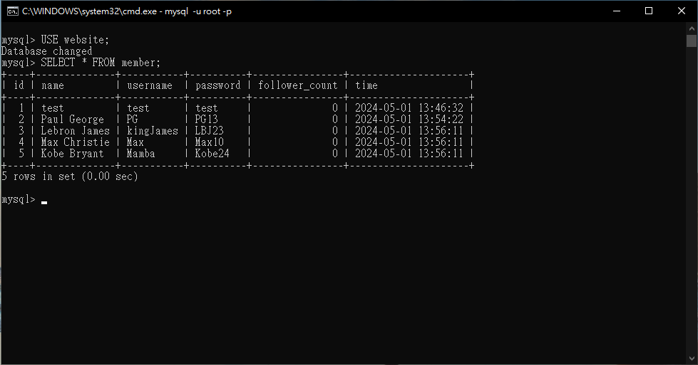
- SELECT all rows from the member table, in descending order of time.
	- SQL statements

		```SQL
		SELECT * FROM member ORDER BY time DESC;
		```
	- screenshot

		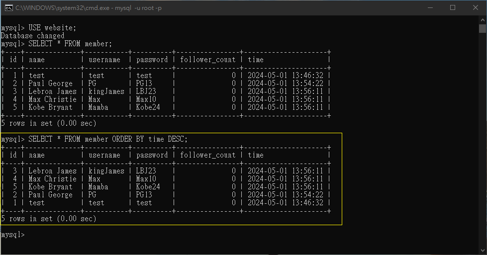
- SELECT total 3 rows, second to fourth, from the member table, in descending order of time. Note: it does not mean SELECT rows where id are 2, 3, or 4.
	- SQL statements

		```SQL
		SELECT * FROM member ORDER BY time DESC LIMIT 1, 3;
		```
	- screenshot

		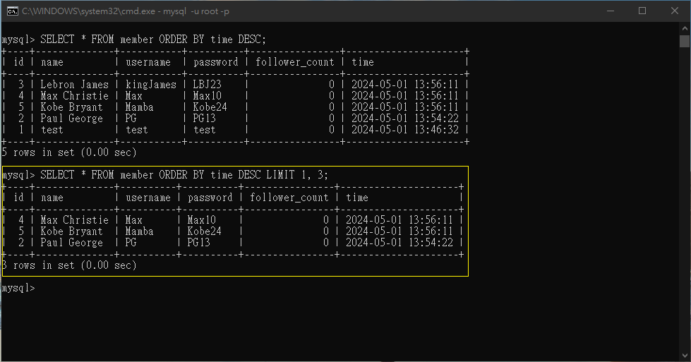
- SELECT rows where username equals to test.
	- SQL statements

		```SQL
		SELECT * FROM member WHERE username = 'test';
		```
	- screenshot

		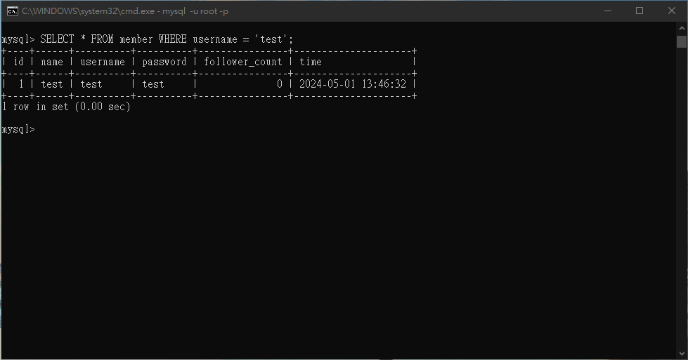
- SELECT rows where name includes the es keyword.
	- SQL statements

		```SQL
		SELECT * FROM member WHERE name LIKE '%es%';
		```
	- screenshot

		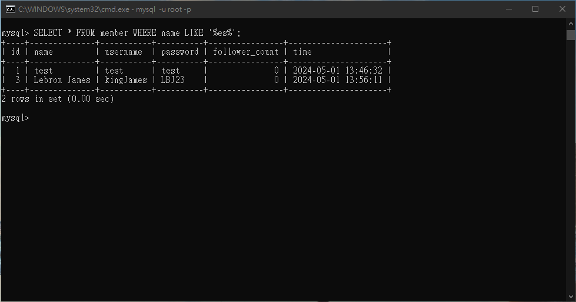
- SELECT rows where both username and password equal to test.
	- SQL statements

		```SQL
		SELECT * FROM member WHERE username = 'test' AND password = 'test';
		```
	- screenshot

		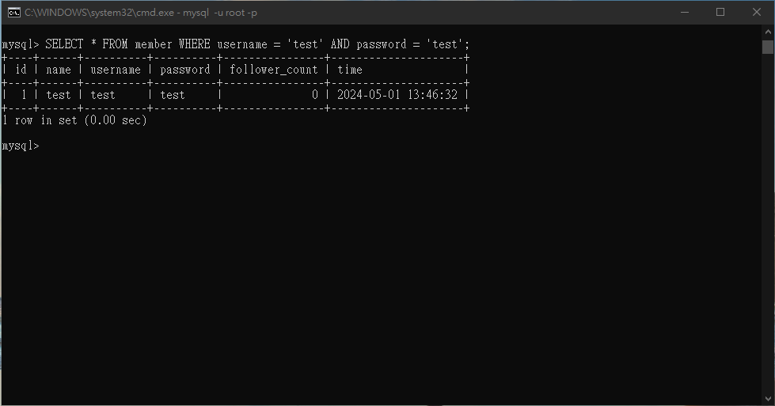
- UPDATE data in name column to test2 where username equals to test.
	- SQL statements

		```SQL
		UPDATE member SET name = 'test2' WHERE username = 'test';
		```
	- screenshot

		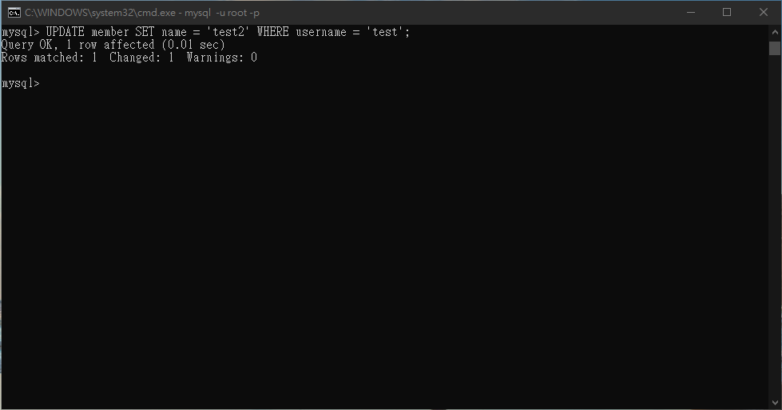
---
## Task 4: SQL Aggregation Functions
- SELECT how many rows from the member table.
	- SQL statements

		```SQL
		SELECT COUNT(*) AS total_rows FROM website.member;
		```
	- screenshot

		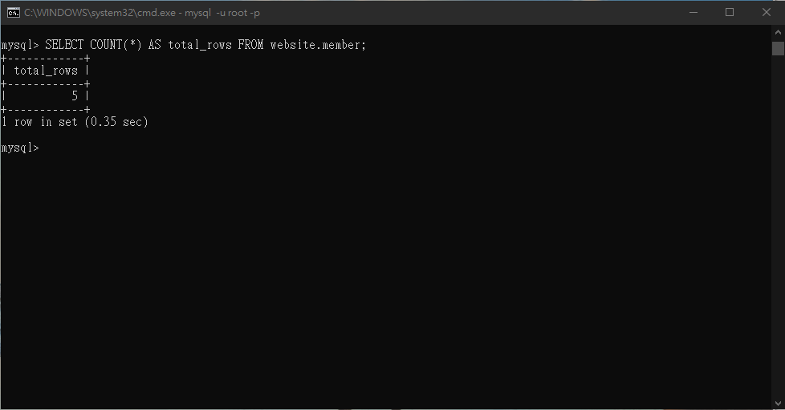
- SELECT the sum of follower_count of all the rows from the member table.
	- SQL statements

		```SQL
		SELECT SUM(follower_count) AS total_follower_count FROM member;
		```
	- screenshot

		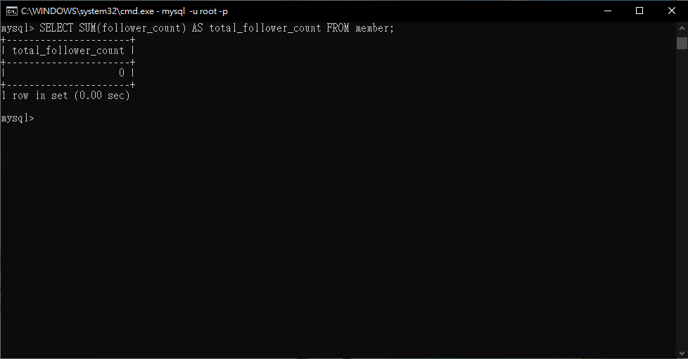
- SELECT the average of follower_count of all the rows from the member table.
	- SQL statements

		```SQL
		SELECT AVG(follower_count) AS average_follower_count FROM member;
		```
	- screenshot

		
- SELECT the average of follower_count of the first 2 rows, in descending order of follower_count, from the member table.
	- SQL statements

		```SQL
		 SELECT AVG(follower_count) AS average_follower_count
		 FROM (SELECT follower_count FROM member ORDER BY follower_count DESC LIMIT 2) AS subquery;
		```
	- screenshot

		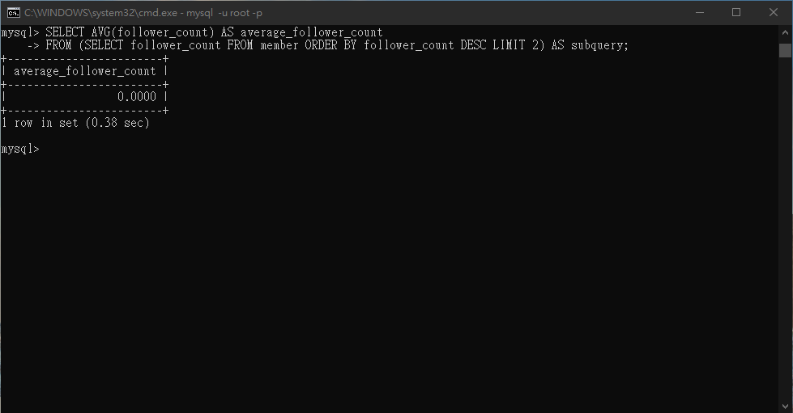
---
## Task 5: SQL JOIN
-  Create a new table named message, in the website database. designed as below:
	- SQL statements

		```SQL
		CREATE TABLE website.message(
			id BIGINT PRIMARY KEY AUTO_INCREMENT COMMENT 'Unique ID',
			member_id BIGINT NOT NULL COMMENT 'Member ID for Message Sender',
			content VARCHAR(255) NOT NULL COMMENT 'Content',
			like_count INT UNSIGNED NOT NULL DEFAULT 0 COMMENT 'Like Count',
			time DATETIME NOT NULL DEFAULT CURRENT_TIMESTAMP COMMENT'Publish Time',
			FOREIGN KEY (member_id) REFERENCES member(id)
		);
		```
	- screenshot

		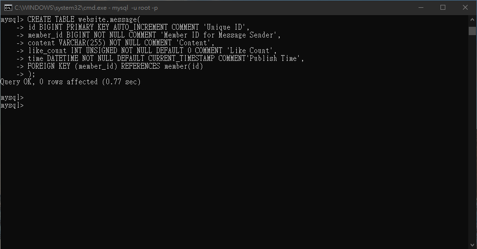
- SELECT all messages, including sender names. We have to JOIN the member table
to get that.
	- SQL statements

		```SQL
		SELECT message.*,member.username AS sendername
		FROM website.message
    	JOIN website.member ON message.member_id = member.id;
		```
	- screenshot

		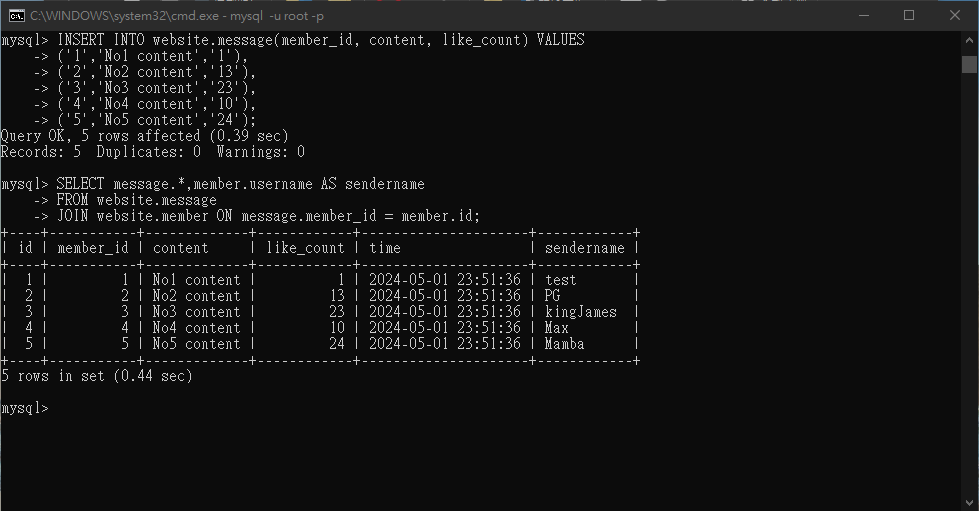
- SELECT all messages, including sender names, where sender username equals to
test. We have to JOIN the member table to filter and get that.
	- SQL statements

		```SQL
		SELECT message.*, member.username AS sendername
		FROM website.message
		JOIN website.member ON message.member_id = member.id
		WHERE member.username = 'test';
		```
	- screenshot

		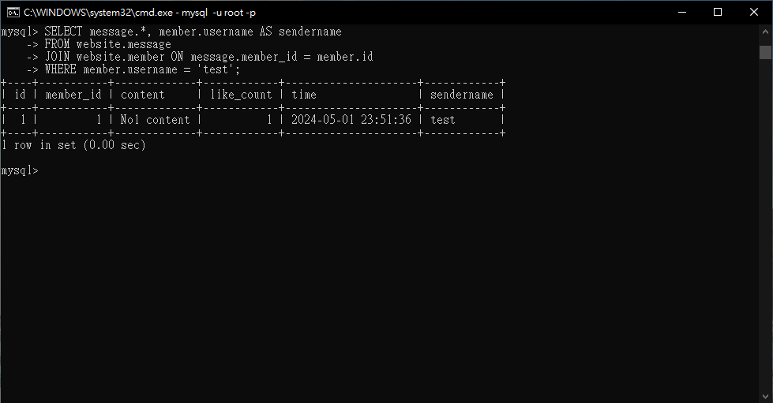
- Use SELECT, SQL Aggregation Functions with JOIN statement, get the average like
count of messages where sender username equals to test.

		```SQL
		SELECT AVG(message.like_count) AS test_average_like_count
    	FROM website.message
    	JOIN website.member ON message.member_id = member.id
    	WHERE member.username = 'test';
		```
	- screenshot

		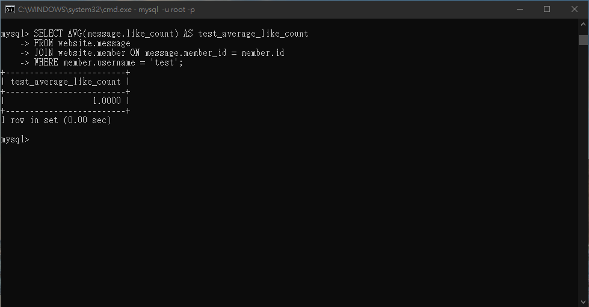
- Use SELECT, SQL Aggregation Functions with JOIN statement, get the average like
count of messages GROUP BY sender username.

		```SQL
		SELECT member.username AS sender_username, AVG(message.like_count) AS average_like_count
		FROM website.message
    	JOIN website.member ON message.member_id = member.id
    	GROUP BY member.username;
		```
	- screenshot

		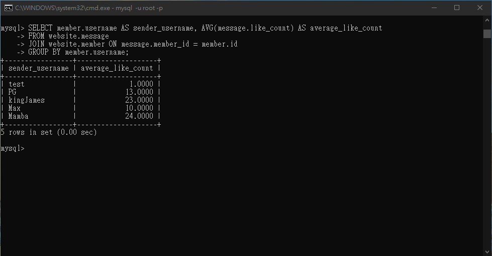